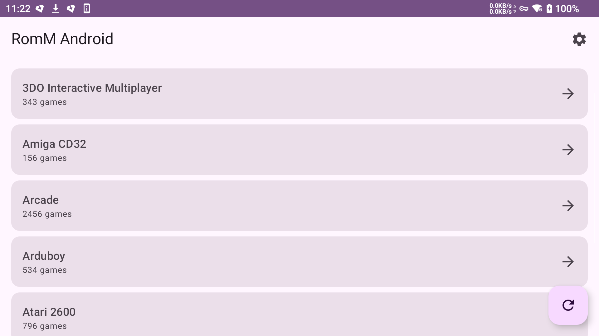
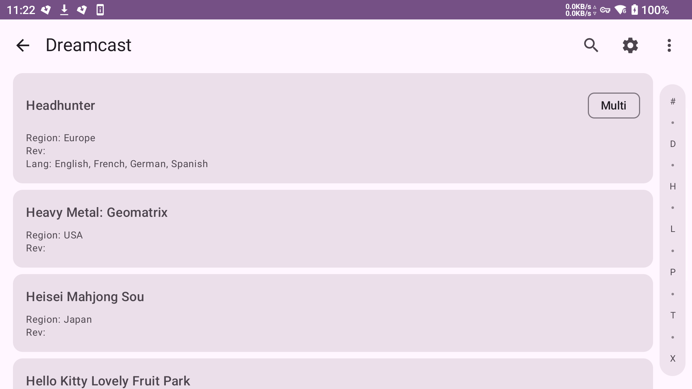
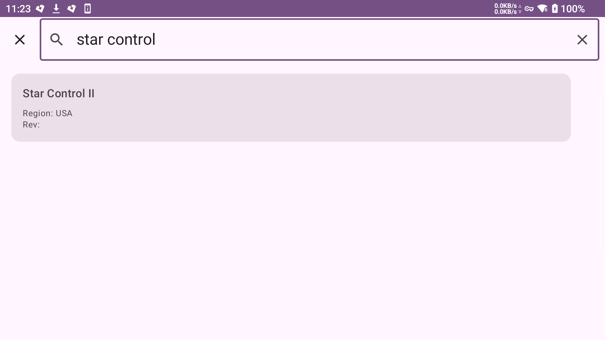
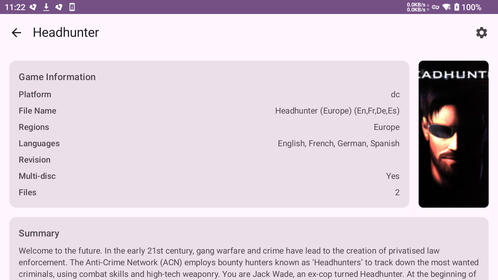
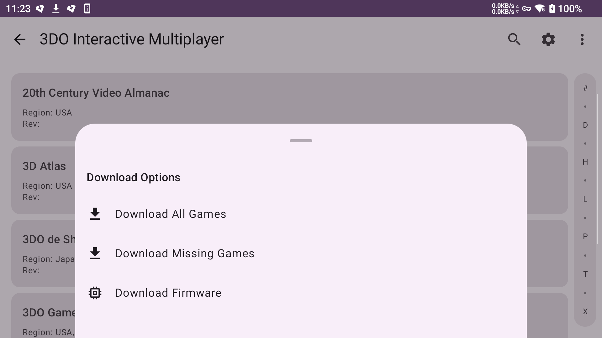

# RomM Android Client

A modern Android app for browsing and downloading ROMs from your RomM server instance.

## Features

- 📱 Modern Material Design 3 UI
- 🎮 Browse platforms and collections
- 🔍 **Real-time search** with instant game filtering
- 🔤 **Alphabet scrubber** for fast navigation through large game lists
- 🎨 **Cover art display** for games in detail view
- 📋 View detailed game information (regions, revisions, languages, tags)
- ⬇️ Download individual games or bulk download entire platforms/collections
- 🔧 Download firmware files for platforms
- 📦 Automatic ZIP extraction for multi-disc games
- 🔄 Smart "download missing games" option
- 📊 **Foreground download service** with persistent notifications
- 📈 **Real-time loading progress** for large game collections
- ⚙️ Configurable concurrent downloads
- 🗂️ Organized file structure ([DOWNLOAD_DIR]/[PLATFORM_SLUG])
- 🎯 **Game controller navigation** support
- 💾 **Save file & save state sync** with timestamped versioning
- 🔄 **Bidirectional sync** for emulator save data
- 📝 **External app integration** via intents

## Screenshots

<div align="center">

### Platform View


### Game List View


### Game List with Search & Alphabet Scrubber


### Game Details with Cover Art


### Bulk Download Menu


</div>

## Setup

1. Open Android Studio
2. Open this project directory
3. Let Gradle sync
4. Build and run on your Android device (API 24+)

## Configuration

On first launch, configure your RomM server settings:
- **Host**: Your RomM server IP address
- **Port**: Usually 8080
- **Username/Password**: Your RomM credentials  
- **Download Directory**: Where to save ROMs
- **Max Concurrent Downloads**: 1-10 simultaneous downloads
- **Save Files Directory**: Where emulator save files are stored
- **Save States Directory**: Where emulator save states are stored
- **History Limits**: Maximum versions to keep on server (0 = unlimited)

## Usage

1. Configure your RomM server connection in Settings
2. Browse platforms or collections with **game controller** or touch navigation
3. Select a platform/collection to view games (with **real-time loading progress** for large collections)
4. **Search and Navigate** through game lists:
   - Tap the **search icon** in the top bar for instant game filtering
   - Use the **alphabet scrubber** on the right side to quickly jump to games starting with specific letters
   - Search respects RomM's sorting logic (ignores articles like "The", "A", "An")
5. View **game details with cover art** and download individual games
6. Use the menu for bulk download options:
   - Download All Games
   - Download Missing Games (skips already downloaded)
   - Download Firmware (for platforms that have it)
7. Downloads run in **foreground service** with persistent notifications showing progress

## Save File & Save State Sync

The app supports bidirectional sync of emulator save data with your RomM server:

### Features
- **Automatic Detection**: Scans your emulator directories for save files and save states
- **Timestamped Versions**: Each upload creates a unique timestamped version (`android-sync-GameName [YYYY-MM-DD HH-mm-ss-SSS].ext`)
- **Smart Conflict Resolution**: Always downloads the most recent version based on file timestamps
- **History Management**: Configurable limits to keep only recent versions on the server
- **Platform Support**: Works with any platform/emulator that stores saves as files

### Sync Modes
- **Upload Only**: Send local saves to server
- **Download Only**: Get saves from server
- **Bidirectional**: Smart sync based on file modification times

### File Organization

Games and save data are organized in your configured directories:
```
[DOWNLOAD_DIR]/
├── SNES/
│   ├── Game1.sfc
│   └── Game2.sfc
├── PSX/
│   ├── Multi-Disc Game/
│   │   ├── disc1.bin
│   │   ├── disc2.bin
│   │   └── game.m3u
└── firmware/
    └── bios.bin

[SAVE_FILES_DIR]/
└── snes/
    └── snes9x/
        ├── Super Mario World.srm
        └── The Legend of Zelda.srm

[SAVE_STATES_DIR]/
└── snes/
    └── snes9x/
        ├── Super Mario World.state
        └── The Legend of Zelda.state
```

## External App Integration

You can trigger sync operations from external apps, scripts, Termux, or ADB using Android intents:

### Basic Sync Intent
```bash
# ADB command for bidirectional sync
adb shell am start -n com.romm.android/.sync.SyncActivity \
  -a android.intent.action.SYNC \
  --ez sync_save_files true \
  --ez sync_save_states true \
  --es sync_direction bidirectional
```

### Termux Script Example
```bash
#!/bin/bash
# Save as sync-romm.sh in Termux

am start -n com.romm.android/.sync.SyncActivity \
  -a android.intent.action.SYNC \
  --ez sync_save_files true \
  --ez sync_save_states true \
  --es sync_direction bidirectional \
  --es platform_filter snes \
  --es emulator_filter snes9x
```

### Available Parameters

| Parameter | Type | Values | Description |
|-----------|------|--------|-------------|
| `sync_direction` | String | `upload`, `download`, `bidirectional` | Sync direction mode |
| `sync_save_files` | Boolean | `true`, `false` | Include save files in sync |
| `sync_save_states` | Boolean | `true`, `false` | Include save states in sync |
| `platform_filter` | String | Platform name | Only sync specific platform |
| `emulator_filter` | String | Emulator name | Only sync specific emulator |
| `game_filter` | String | Game filename | Only sync specific game (without extension) |
| `dry_run` | Boolean | `true`, `false` | Plan only, don't execute |

**Note**: History limits are automatically applied based on your app settings - no need to specify them in external calls.

### Advanced Examples

**Upload only SNES saves:**
```bash
adb shell am start -n com.romm.android/.sync.SyncActivity \
  -a android.intent.action.SYNC \
  --es sync_direction upload \
  --ez sync_save_files true \
  --ez sync_save_states false \
  --es platform_filter snes
```

**Download only save states for specific emulator:**
```bash
adb shell am start -n com.romm.android/.sync.SyncActivity \
  -a android.intent.action.SYNC \
  --es sync_direction download \
  --ez sync_save_files false \
  --ez sync_save_states true \
  --es emulator_filter retroarch
```

**Sync specific game only:**
```bash
adb shell am start -n com.romm.android/.sync.SyncActivity \
  -a android.intent.action.SYNC \
  --es sync_direction bidirectional \
  --ez sync_save_files true \
  --ez sync_save_states true \
  --es game_filter "Super Mario World"
```

**Dry run to see what would be synced:**
```bash
adb shell am start -n com.romm.android/.sync.SyncActivity \
  -a android.intent.action.SYNC \
  --ez dry_run true
```

### Integration with Emulators

You can create scripts to automatically sync before/after playing games:

**Pre-game sync (download latest saves):**
```bash
# Download latest saves before launching emulator
am start -n com.romm.android/.sync.SyncActivity \
  -a android.intent.action.SYNC \
  --es sync_direction download \
  --es game_filter "Super Mario World"

# Wait for sync to complete, then launch your emulator
# (Add sleep or check for completion as needed)
```

**Post-game sync (upload saves after playing):**
```bash
# After emulator closes, upload saves
am start -n com.romm.android/.sync.SyncActivity \
  -a android.intent.action.SYNC \
  --es sync_direction upload \
  --es game_filter "Super Mario World"
```

## Requirements

- Android 7.0+ (API 24)
- RomM server instance
- Internet connection to RomM server

## Technologies

- Kotlin + Jetpack Compose
- Material Design 3
- Retrofit for API communication
- Hilt for dependency injection
- **Foreground services** for reliable downloads
- Coil for cover art image loading
- DataStore for settings persistence

## Permissions

- **INTERNET**: Connect to RomM server
- **WRITE_EXTERNAL_STORAGE**: Save downloaded files and sync save data
- **POST_NOTIFICATIONS**: Show download and sync progress
- **FOREGROUND_SERVICE**: Background downloads and sync operations
- **MANAGE_EXTERNAL_STORAGE**: Access emulator save directories (Android 11+)

Built with ❤️ for the retro gaming community.
